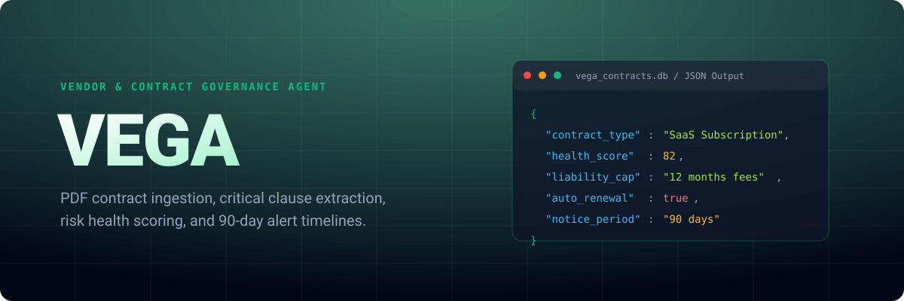
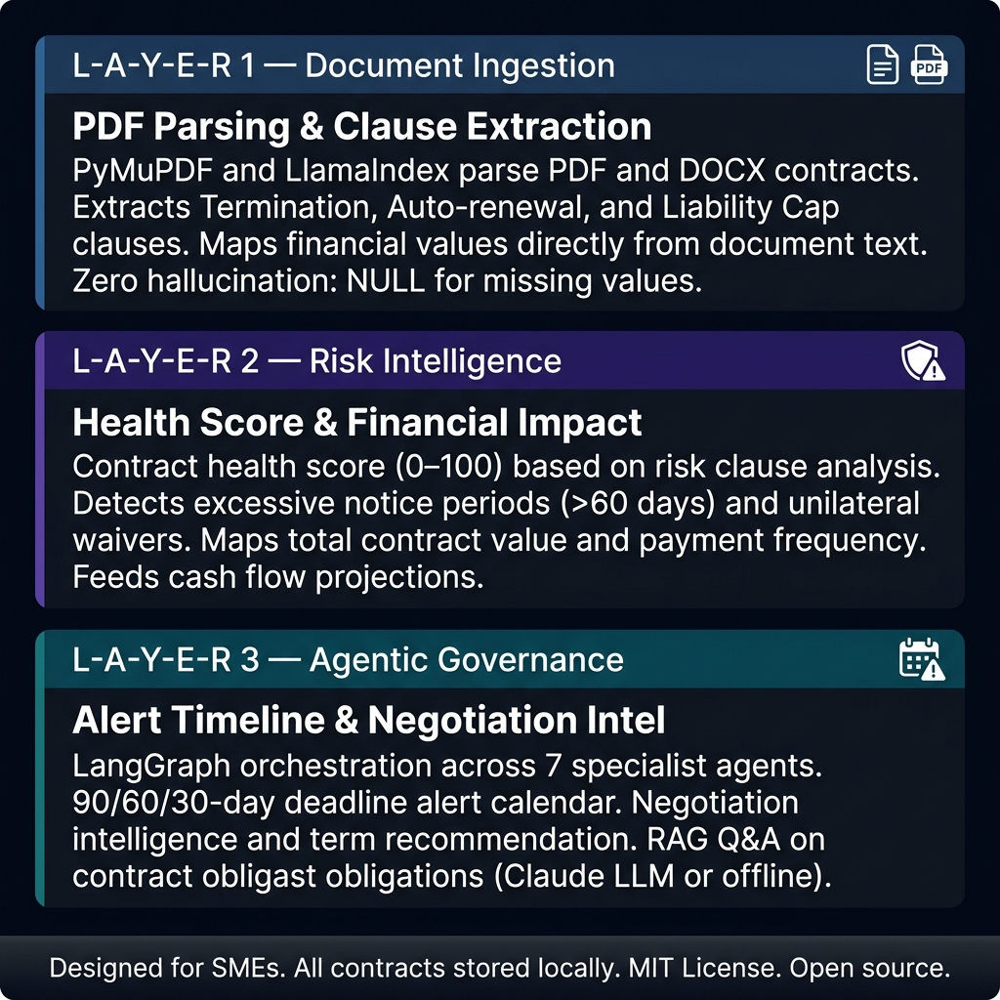
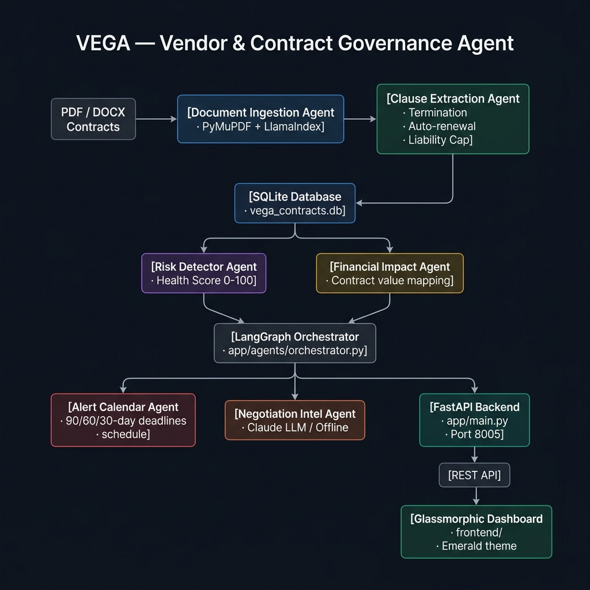

<div align="center">
  <picture>
    
  </picture>
</div>

**An open-source vendor and contract governance agent for SMEs.**

VEGA ingests PDF and DOCX contracts, extracts critical clauses (termination, auto-renewal, liability caps), computes a contract health score, maps financial exposure, and triggers deadline alerts 90, 60, and 30 days before critical dates — all running locally with zero cloud dependency and a strict anti-hallucination policy.

---

## Why it is different

**Anti-hallucination architecture**
Every clause stored in the database includes the `original_text` field — the exact, verbatim string from the PDF. Financial values not found in the document are stored as `NULL`, never estimated. The LLM never invents dates, values, or clause content. Date extraction is driven via regex, not LLM.

**Local-first document processing**
All PDF parsing, clause extraction, and risk scoring happen on your machine. Only the negotiation narrative generation optionally contacts the Claude API — and only with structured clause metadata, never raw contract text.

**Zero-server dependency**
Uses SQLite. The full governance pipeline starts simply with `python run.py`.

---

## How it works

<picture>
  
</picture>

### 1. Document Ingestion
Parses PDF/DOCX contracts using PyMuPDF and LlamaIndex. Identifies Termination, Auto-renewal, and Liability Cap clauses. Maps financial values directly from the contract document. **(Novo: Ingestão Mágica via Email/IMAP).**

### 2. Risk Intelligence
Computes a contract health score (0–100) based on risk clause analysis. Maps total contract value to feed **Value Leakage** cash flow projections. **(Novo: Vendor Risk Radar com integração OFAC).**

### 3. Agentic Governance
LangGraph orchestrates seven specialist agents. An alert calendar schedules notifications 90/60/30 days before cancellation windows **(integrado com Slack/Teams Webhooks)**. A negotiation intelligence agent generates term recommendations and **Smart Collaborative Drafting (Redlines)** based on internal Playbooks via Claude API.

---

## How to use

VEGA is built for SME owners, operations managers, procurement teams, and legal professionals. **You do not need a legal background to use VEGA.** 

### Quickstart

```bash
git clone https://github.com/afild/vega.git
cd vega
python -m venv venv
source venv/bin/activate   # Windows: venv\Scripts\activate
pip install -r requirements.txt
cp .env.example .env
python run.py
```
Open `http://localhost:8005/static/index.html` in your browser.

### AI Modes

VEGA defaults to **Offline Mode** where all scoring and extraction operate locally, and negotiation intelligence uses rule-based templates.

To enable **LLM Mode** (Anthropic Claude):
```bash
export ANTHROPIC_API_KEY=your_key_here   # Linux/macOS
set ANTHROPIC_API_KEY=your_key_here      # Windows
python run.py
```

---

## Details

<details>
<summary><strong>Architecture & Flow</strong></summary>

<picture>
  
</picture>

</details>

<details>
<summary><strong>REST API Surface</strong></summary>

| Endpoint | Method | Description |
|---|---|---|
| `/contracts` | `GET / POST` | List contracts or upload new PDF/DOCX for processing |
| `/contracts/{id}/terminate`| `POST` | Generate 1-Click Terminate email draft (`mailto:`) |
| `/alerts` | `GET` | Active deadline alerts (90/60/30-day windows) |
| `/analysis` | `GET` | Risk health score and clause analysis per contract |
| `/analysis/value-leakage`| `GET` | Aggregated financial leakage chart data |
| `/negotiation` | `POST` | Generate negotiation intelligence for a contract |
| `/system` | `GET` | System status, AI mode (`llm` or `offline`), version |

</details>

<details>
<summary><strong>Tech Stack</strong></summary>

| Component | Technology |
|---|---|
| Backend | FastAPI 0.115 (Python 3.11+) |
| Agent Orchestration | LangGraph 0.2.39 · LangChain 0.3.7 |
| Document Parsing | PyMuPDF 1.24.11 · LlamaIndex 0.11.22 |
| AI Narrative | Anthropic Claude (optional) · offline heuristics |
| Alert Scheduling | schedule 1.2.2 |
| Database | SQLite (zero-server, local-first) · SQLAlchemy |
| Dashboard | HTML + CSS + JavaScript · Chart.js (Emerald theme) |
| Testing | pytest · pytest-asyncio · httpx |

</details>

<details>
<summary><strong>NIST AI RMF 1.0 Alignment</strong></summary>

| NIST Function | VEGA Implementation |
|---|---|
| **GOVERN** | MIT License · anti-hallucination policy documented · traceable clause extraction |
| **MAP** | Contract governance domain scoped to SME vendor management · documented extraction rules |
| **MEASURE** | pytest suite · regex validation on extracted dates · NULL enforcement on missing financial values |
| **MANAGE** | Offline fallback · original_text field enforced · human review before negotiation dispatch |

</details>

---

## Contributing
Areas where contributions are most needed:
- DOCX clause extraction improvements (python-docx integration)
- Multi-language contract support (Spanish, Portuguese)
- Contract comparison across versions (diff analysis)
- Docker Compose setup for zero-dependency deployment

**License:** MIT License — free to use, adapt, and redistribute.
